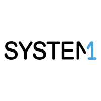
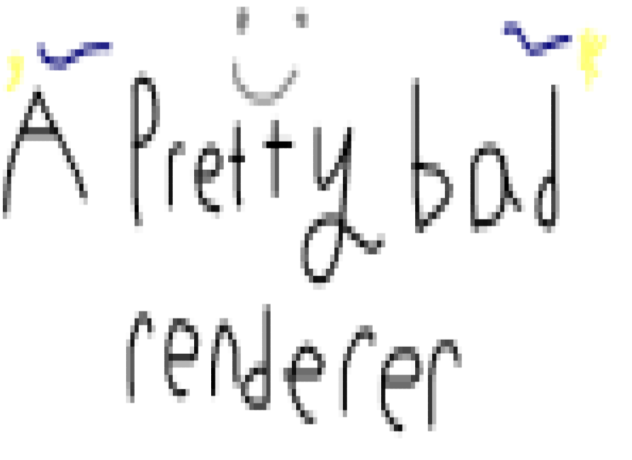

  

  <h1>⋆౨ৎ˚⟡˖₊˚⊹ Joe Huber ⋆౨ৎ˚⟡˖₊˚⊹</h1>

  

    
    
    
  

<!-- Animated divider definition (SMIL, works on GitHub) -->
<svg width="0" height="0" aria-hidden="true" focusable="false">
  <defs>
    <linearGradient id="purple-sheen" x1="0%" y1="0%" x2="100%" y2="0%">
      <stop offset="-1" stop-color="#5B16A3">
        <animate attributeName="offset" values="-1;1" dur="3s" repeatCount="indefinite" />
      </stop>
      <stop offset="0" stop-color="#8A2BE2">
        <animate attributeName="offset" values="0;2" dur="3s" repeatCount="indefinite" />
      </stop>
      <stop offset="1" stop-color="#C084F5">
        <animate attributeName="offset" values="1;3" dur="3s" repeatCount="indefinite" />
      </stop>
    </linearGradient>
  </defs>
</svg>

  <a href="#about">About Me</a> •
  <a href="#connect">Connect</a> •
  <a href="#tech-stack">Tech Stack</a> •
  <a href="#experience">Experience</a> •
  <a href="#education">Education</a> •
  <a href="#projects">Projects</a> •
  <a href="#stats">Stats</a>

<h2 id="about">💜 About Me</h2>

- Located in Los Angeles & Evanston
- First-year student at **Northwestern University**
- Sometimes when I'm bored I add a new thing to this read me :D

<h2 id="connect">💜 Connect with me</h2>

  
  <a href="https://github.com/Joe-Huber" target="_blank" rel="noopener noreferrer">
    <picture>
      <source media="(prefers-color-scheme: dark)" srcset="https://cdn.simpleicons.org/github/white" />
      <source media="(prefers-color-scheme: light)" srcset="https://cdn.jsdelivr.net/gh/devicons/devicon/icons/github/github-original.svg" />
      
    </picture>
  </a>
  

## 💜 Tech Stack
<table align="center" id="tech-stack">
  <tr>
    <td align="center" width="140">
      <strong>Languages</strong>
    </td>
    <td>
      
      
      
      
      
      
      
      
      
      
    </td>
  </tr>
  <tr>
    <td align="center">
      <strong>Frameworks & Libraries</strong>
    </td>
    <td>
      <!--  -->
      <!--  -->
      
      
      
      
      
    </td>
  </tr>
  <tr>
    <td align="center">
      <strong>Web Frontend & Runtime</strong>
    </td>
    <td>
      
      
      
    </td>
  </tr>
  <tr>
    <td align="center">
      <strong>Tools & Platforms</strong>
    </td>
    <td>
      
      <a href="https://github.com/" target="_blank" rel="noopener noreferrer"><picture><source media="(prefers-color-scheme: dark)" srcset="https://cdn.simpleicons.org/github/white" />
      <source media="(prefers-color-scheme: light)" srcset="https://cdn.jsdelivr.net/gh/devicons/devicon/icons/github/github-original.svg" />
      </picture></a>
      
      
      
    </td>
  </tr>
  <tr>
    <td align="center">
      <strong>Web scraping</strong>
    </td>
    <td>
      
      
    </td>
  </tr>
  <tr>
    <td align="center">
      <strong>Cloud</strong>
    </td>
    <td>
      
      
      
      
    </td>
  </tr>
  <tr>
    <td align="center">
      <strong>AI & Assistants</strong>
    </td>
    <td>
      
      
      
      
      
    </td>
  </tr>
</table>

## 💜 Experience
<table>
  <tr>
    <td width="140" align="center" valign="middle" id="experience">
      
    </td>
    <td>
      <h3><a href="https://system1.com/" target="_blank" rel="noopener noreferrer">System1</a></h3>
      

        System1 operates an industry-leading responsive acquisition marketing platform (RAMP) powered by AI and machine learning.
      

      <ul>
        <li><strong>Role:</strong> Quality Assurance Engineering Intern</li>
      </ul>
    </td>
  </tr>
  <tr>
    <td width="140" align="center" valign="middle">
      
    </td>
    <td>
      <h3><a href="https://www.pvnet.com/" target="_blank" rel="noopener noreferrer">PVNet Technology Education Center</a></h3>
      

        PVNet is a non-profit community technology organization offering STEM education for ages 10–104, from novice to professional.
      

      <ul>
        <li><strong>Role:</strong> Intern</li>
      </ul>
    </td>
  </tr>
</table>

<h2 id="education">💜 Education</h2>
<table>
  <tr>
    <td width="140" align="center" valign="middle">
      
    </td>
    <td>
      <h3><a href="https://www.northwestern.edu/" target="_blank" rel="noopener noreferrer">Northwestern University</a></h3>
      

        McCormick School of Engineering
      

      <ul>
        <li><strong>Major:</strong> Computer Science BS/MS</li>
        <li><strong>Expected Graduation Year:</strong> 2029</li>
      </ul>
    </td>
  </tr>
  <tr>
    <td width="140" align="center" valign="middle">
      
    </td>
    <td>
      <h3><a href="https://www.chadwickschool.org/" target="_blank" rel="noopener noreferrer">Chadwick School</a></h3>
      <ul>
        <li><strong>Graduation Year:</strong> 2025</li>
      </ul>
    </td>
  </tr>
</table>

<h2 id="projects">💜 Projects</h2>

<table align="center">
  <tr>
    <td align="center" valign="top" width="33%">
      <a href="https://github.com/Joe-Huber/CopyPastePlus" target="_blank" rel="noopener noreferrer">
        
        <h3>CopyPaste+</h3>
      </a>
      
Expand copy/paste in Chrome with a history, favorites, and usage counts — all from the toolbar popup.

    </td>
    <td align="center" valign="top" width="33%">
      <a href="https://github.com/moonish1211/Cosmic-Crashout-Public" target="_blank" rel="noopener noreferrer">
        
        <h3>Cosmic Crashout</h3>
      </a>
      
An accessible game designed for quadriplegic players using the OpenBCI EEG headset. Built with PVNet Advanced Technology Center.

    </td>
    <td align="center" valign="top" width="33%">
      <a href="https://github.com/Joe-Huber/Text-Editor" target="_blank" rel="noopener noreferrer">
        
        <h3>Text Editor</h3>
      </a>
      
A JavaFX learning-focused editor with a custom Document → Paragraph → Word → Character model and a clear render pipeline.

    </td>
  </tr>
  <tr>
    <td align="center" valign="top" width="33%">
      <a href="https://github.com/Joe-Huber/my-most-followed-followers" target="_blank" rel="noopener noreferrer">
        <picture>
          <source media="(prefers-color-scheme: dark)" srcset="https://cdn.simpleicons.org/github/white" />
          <source media="(prefers-color-scheme: light)" srcset="https://cdn.jsdelivr.net/gh/devicons/devicon/icons/github/github-original.svg" />
          
        </picture>
        <h3>My Most Followed Followers</h3>
      </a>
      
A project to identify and display your most followed followers on GitHub.

    </td>
    <td align="center" valign="top" width="33%">
      <a href="https://github.com/Joe-Huber/a-pretty-bad-renderer" target="_blank" rel="noopener noreferrer">
        
        <h3>A Pretty Bad Renderer</h3>
      </a>
      
A simple image renderer in the terminal built in python.

    </td>
    <td align="center" valign="top" width="33%">
      <!-- Placeholder for another project -->
    </td>
  </tr>
</table>

<!-- Pinned repo cards -->

  <a href="https://github.com/Joe-Huber/CopyPastePlus" target="_blank" rel="noopener noreferrer">
    <picture>
      <source media="(prefers-color-scheme: dark)" srcset="https://github-stats-extended.vercel.app/api/pin/?username=Joe-Huber&repo=CopyPastePlus&theme=shades-of-purple" />
      <source media="(prefers-color-scheme: light)" srcset="https://github-stats-extended.vercel.app/api/pin/?username=Joe-Huber&repo=CopyPastePlus&theme=buefy" />
      
    </picture>
  </a>
  <a href="https://github.com/moonish1211/Cosmic-Crashout-Public" target="_blank" rel="noopener noreferrer">
    <picture>
      <source media="(prefers-color-scheme: dark)" srcset="https://github-stats-extended.vercel.app/api/pin/?username=moonish1211&repo=Cosmic-Crashout-Public&theme=shades-of-purple" />
      <source media="(prefers-color-scheme: light)" srcset="https://github-stats-extended.vercel.app/api/pin/?username=moonish1211&repo=Cosmic-Crashout-Public&theme=buefy" />
      
    </picture>
  </a>
  <a href="https://github.com/Joe-Huber/Text-Editor" target="_blank" rel="noopener noreferrer">
    <picture>
      <source media="(prefers-color-scheme: dark)" srcset="https://github-stats-extended.vercel.app/api/pin/?username=Joe-Huber&repo=Text-Editor&theme=shades-of-purple" />
      <source media="(prefers-color-scheme: light)" srcset="https://github-stats-extended.vercel.app/api/pin/?username=Joe-Huber&repo=Text-Editor&theme=buefy" />
      
    </picture>
  </a>
  <a href="https://github.com/Joe-Huber/my-most-followed-followers" target="_blank" rel="noopener noreferrer">
    <picture>
      <source media="(prefers-color-scheme: dark)" srcset="https://github-stats-extended.vercel.app/api/pin/?username=Joe-Huber&repo=my-most-followed-followers&theme=shades-of-purple" />
      <source media="(prefers-color-scheme: light)" srcset="https://github-stats-extended.vercel.app/api/pin/?username=Joe-Huber&repo=my-most-followed-followers&theme=buefy" />
      
    </picture>
  </a>
  <a href="https://github.com/Joe-Huber/a-pretty-bad-renderer" target="_blank" rel="noopener noreferrer">
    <picture>
      <source media="(prefers-color-scheme: dark)" srcset="https://github-stats-extended.vercel.app/api/pin/?username=Joe-Huber&repo=a-pretty-bad-renderer&theme=shades-of-purple" />
      <source media="(prefers-color-scheme: light)" srcset="https://github-stats-extended.vercel.app/api/pin/?username=Joe-Huber&repo=a-pretty-bad-renderer&theme=buefy" />
      
    </picture>
  </a>

## 💜 Stats

  <a href="https://github.com/stats-organization/github-stats-extended" target="_blank" rel="noopener noreferrer">
    <picture>
      <source media="(prefers-color-scheme: dark)" srcset="https://github-stats-extended.vercel.app/api?username=Joe-Huber&theme=shades-of-purple" />
      <source media="(prefers-color-scheme: light)" srcset="https://github-stats-extended.vercel.app/api?username=Joe-Huber&theme=buefy" />
      
    </picture>
  </a>
  <a href="https://github.com/stats-organization/github-stats-extended" target="_blank" rel="noopener noreferrer">
    <picture>
      <source media="(prefers-color-scheme: dark)" srcset="https://github-stats-extended.vercel.app/api/top-langs/?username=Joe-Huber&layout=compact&theme=shades-of-purple" />
      <source media="(prefers-color-scheme: light)" srcset="https://github-stats-extended.vercel.app/api/top-langs/?username=Joe-Huber&layout=compact&theme=buefy" />
      
    </picture>
  </a>
   
  <a href="https://git.io/streak-stats" target="_blank" rel="noopener noreferrer">
    <picture>
      <source media="(prefers-color-scheme: dark)" srcset="https://streak-stats.demolab.com/?user=Joe-Huber&theme=shades-of-purple" />
      <source media="(prefers-color-scheme: light)" srcset="https://streak-stats.demolab.com/?user=Joe-Huber&theme=buefy" />
      
    </picture>
  </a>
   
  <picture>
    <source media="(prefers-color-scheme: dark)" srcset="https://github-profile-trophy-tawny.vercel.app/?username=Joe-Huber&theme=aura&no-frame=true&row=1&margin-w=12" />
    <source media="(prefers-color-scheme: light)" srcset="https://github-profile-trophy-tawny.vercel.app/?username=Joe-Huber&theme=flat&no-frame=true&row=1&margin-w=12" />
    
  </picture>
   
  
   
  <picture>
    <source media="(prefers-color-scheme: dark)" srcset="https://raw.githubusercontent.com/Joe-Huber/Joe-Huber/output/github-contribution-grid-snake-dark.svg" />
    <source media="(prefers-color-scheme: light)" srcset="https://raw.githubusercontent.com/Joe-Huber/Joe-Huber/output/github-contribution-grid-snake.svg" />
    
  </picture>

<!-- FOLLOWERS_LIST_START -->

### [My Most Famous Followers](https://github.com/Joe-Huber/my-most-followed-followers)

| Profile | Name | Followers |
|---|---|---|
|  | [AwesomeCoder412412](https://github.com/AwesomeCoder412412) | 9 |
|  | [macnmath](https://github.com/macnmath) | 2 |
|  | [KadenXu5001](https://github.com/KadenXu5001) | 1 |

*Last updated: 2026-02-15 02:25:25 UTC*
<!-- FOLLOWERS_LIST_END -->

> Note: Stats reflect public repositories only. Third-party badges/images may be rate-limited by their providers.

🫶💜

  

